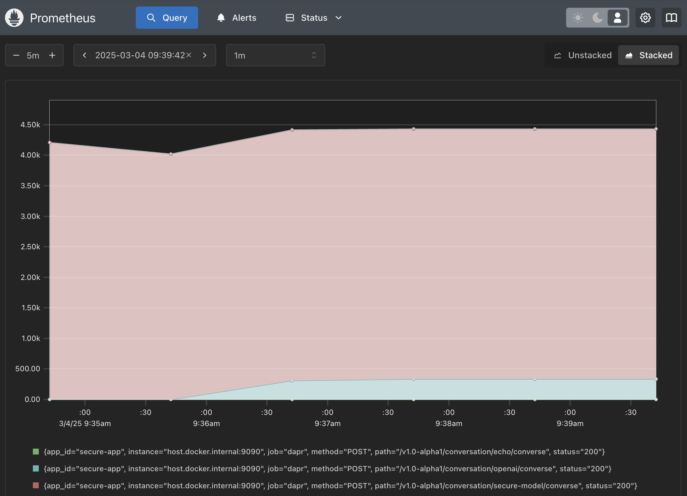

# Dapr Conversation API Examples


This repository demonstrates how to use Dapr's Conversation API to interact with LLMs (Large Language Models). These examples complement the blog post "Operationalizing LLM Interactions with Dapr's New Conversation API" and showcase various capabilities including basic interactions, secure configurations, PII protection, resiliency patterns, monitoring, and tracing.

## Prerequisites
- [Docker](https://docs.docker.com/get-docker/)
- [Dapr CLI](https://docs.dapr.io/getting-started/install-dapr-cli/) (v1.15+)
- [REST Client extension](https://marketplace.visualstudio.com/items?itemName=humao.rest-client) (for VS Code) or cURL
- [.NET 8.0 SDK](https://dotnet.microsoft.com/download/dotnet/8.0) (for .NET examples only)

## 1. Basic Conversation with Echo Component

The Echo component provides a simple way to test your Conversation API configuration without requiring external API credentials. It returns the prompt it is given.

### Configuration

The Echo component is defined in [`components/echo.yaml`](./components/echo.yaml):

```yaml
apiVersion: dapr.io/v1alpha1
kind: Component
metadata:
  name: echo
spec:
  type: conversation.echo
  version: v1
```

### Running the Echo Example

Start a Dapr sidecar with the Echo component in the project directory. The Dapr sidecar is a process that runs alongside your application and provides the Dapr APIs.

```bash
dapr run --app-id test-echo --resources-path ./components --dapr-http-port 3500 -- tail -f
```

### Interacting with the Echo Component

Send a request to the Conversation API using the REST client as configured in the [`http/test.rest`](./http/test.rest) file:

```http
POST http://localhost:3500/v1.0-alpha1/conversation/echo/converse
Content-Type: application/json

{
  "inputs": [
    {
      "content": "What is Dapr in one sentence?"
    }
  ]
}
```

**Expected Outcome**: The Echo component will mirror your input message back to you, confirming that your request was properly formatted and the Conversation API is working correctly.

## 2. Using a Real LLM Provider with OpenAI

After testing with the Echo component, let's switch to a real LLM provider. The OpenAI component configuration allows you to connect to OpenAI's models with minimal setup.

### Configuration

The OpenAI component is defined in [`components/openai.yaml`](./components/openai.yaml):

```yaml
apiVersion: dapr.io/v1alpha1
kind: Component
metadata:
  name: openai
spec:
  type: conversation.openai
  metadata:
    - name: key
      value: <OPENAI_API_KEY>
    - name: model
      value: gpt-4-turbo
    - name: cacheTTL
      value: 10m
```

Simply replace `<OPENAI_API_KEY>` with your actual API key. The `cacheTTL` parameter enables Dapr to cache responses for 10 minutes, reducing costs and improving performance for repeated queries.

### Interacting with OpenAI

Start a Dapr sidecar with the OpenAI component:

```bash
dapr run --app-id test-openai --resources-path ./components --dapr-http-port 3500 -- tail -f
```

Send a request using the HTTP API as shown in [`http/test.rest`](./http/test.rest):

```http
POST http://localhost:3500/v1.0-alpha1/conversation/openai/converse
Content-Type: application/json

{
  "inputs": [
    {
      "content": "What is Dapr in one sentence?"
    }
  ]
}
```

**Expected Outcome**: OpenAI will respond with a concise definition of Dapr, demonstrating that your application is now using a real LLM provider with the same API you used for the Echo component.

## 3. Enterprise-Grade Security for LLM Access

For production environments, embedding API keys directly in component files is not secure. Dapr's secret store integration allows you to store sensitive information securely and reference it from your components.

### Configuration

The secure component in [`components/secure-component.yaml`](./components/secure-component.yaml) references a secret store:

```yaml
apiVersion: dapr.io/v1alpha1
kind: Component
metadata:
  name: secure-model
spec:
  type: conversation.openai
  version: v1
  metadata:
    - name: model
      value: gpt-4-turbo
    - name: key
      secretKeyRef:
        name: api-key
        key: api-key
scopes:
  - secure-app
auth:
  secretStore: localsecretstore
```

The secret store configuration in [`components/localsecretstore.yaml`](./components/localsecretstore.yaml):

```yaml
apiVersion: dapr.io/v1alpha1
kind: Component
metadata:
  name: localsecretstore
spec:
  type: secretstores.local.file
  version: v1
  metadata:
  - name: secretsFile
    value: ./components/secrets.json
  - name: nestedSeparator
    value: ":"
  scopes:
    - secure-app
```

For local development, we're using a local file secret store that reads from [`components/secrets.json`](./components/secrets.json), but in production, this could be replaced with Azure Key Vault, AWS Secrets Manager, HashiCorp Vault, or other enterprise secret providers without changing your application code.

### Using the .NET SDK with PII Protection

The C# application demonstrates accessing the secure component and protecting personally identifiable information (PII). Because of the `scopes` configuration, only applications with the `secure-app` ID can access this component, providing granular access control.

First, build the .NET application:

```bash
cd csharp
dotnet build
cd ..
```

Then run the Dapr sidecar with the application (note that we run from the project root as secret file locations are relative):

```bash
dapr run --app-id secure-app --resources-path ./components --dapr-http-port 3500 -- dotnet run --project ./csharp
```

The application code in [`csharp/Program.cs`](./csharp/Program.cs) shows how to:
1. Use the Dapr Conversation SDK
2. Set up PII scrubbing to automatically redact sensitive information
3. Configure conversation parameters like temperature

```csharp
   var options = new ConversationOptions
   {
     ScrubPII = true,
     Temperature = 0.5,
     ConversationId = Guid.NewGuid().ToString()
   };
   
   // Send a request to the echo mock LLM component
   var response = await conversationClient.ConverseAsync(
     ConversationComponentName,
   //        [new(prompt, DaprConversationRole.User)]
     [new DaprConversationInput(Content: prompt, Role: DaprConversationRole.Generic, ScrubPII: true)],
     options);
```

**Expected Outcome**: The application will send a message containing an email address, which gets automatically redacted before being sent to OpenAI. The API key is securely retrieved from the secret store, and only the authorized application (`secure-app`) can access this component.

## 4. Building Resilient LLM Interactions

LLM services can be unreliable due to rate limits, temporary outages, or network issues. Dapr's resiliency features help you handle these challenges without writing complex error handling code.

### Configuration

The resiliency configuration in [`components/resiliency.yaml`](./components/resiliency.yaml) defines policies for timeouts, retries, and circuit breaking:

```yaml
apiVersion: dapr.io/v1alpha1
kind: Resiliency
metadata:
  name: llm-resiliency
scopes:
  - secure-app
spec:
  policies:
    timeouts:
      llm-timeout: 60s
    retries:
      llm-retry:
        policy: exponential
        maxRetries: 3
        maxInterval: 10s
        matching:
          httpStatusCodes: 429,500,502-504
    circuitBreakers:
      llm-circuit-breaker:
        maxRequests: 1
        timeout: 300s
        trip: consecutiveFailures > 5
        interval: 0s
  targets:
    components:
      openai:
        outbound:
          timeout: llm-timeout
          retry: llm-retry
          circuitBreaker: llm-circuit-breaker
```

This configuration:
- Sets a 60-second timeout for LLM requests
- Automatically retries on common error codes (429 for rate limits, 5xx for server errors) with exponential backoff
- Implements a circuit breaker that opens after 5 consecutive failures, preventing cascading failures during outages

No application code changes are needed to benefit from this resiliency - Dapr handles it automatically when you run your application with these configurations. These policies would be triggered if the LLM API becomes unavailable or experiences issues.

## 5. Gaining Operational Visibility with Distributed Tracing

To monitor LLM interactions in production, you need visibility into request flow, latency, and errors. Dapr's distributed tracing integrates with your existing observability stack.

### Configuration

The tracing configuration in [`components/tracing-config.yaml`](./components/tracing-config.yaml):

```yaml
apiVersion: dapr.io/v1alpha1
kind: Configuration
metadata:
  name: daprConfig
  namespace: default
spec:
  tracing:
    samplingRate: "1"
    zipkin:
      endpointAddress: "http://localhost:9411/api/v2/spans"
```

When running Dapr locally with the CLI, Zipkin is already started for you, making it easy to explore traces of your application's interactions with LLMs.

### Running with Tracing Enabled

Start the Dapr sidecar with tracing enabled and a specific metrics port:

```bash
dapr run --app-id secure-app --resources-path ./components --dapr-http-port 3500 --config=./components/tracing-config.yaml --metrics-port 9090 -- tail -f
```

You can explore traces in Zipkin at:
```
http://localhost:9411/zipkin/
```

This provides visibility into every conversation request, showing exactly how long each step takes and identifying any bottlenecks or errors in your LLM processing pipeline.

## 6. Monitoring LLM Operations with Metrics

Beyond traces, Dapr provides detailed metrics for LLM operations that you can monitor with standard tools like Prometheus.

### Configuration

The Prometheus configuration in [`components/prometheus.yml`](./components/prometheus.yml):

```yaml
global:
  scrape_interval:     5s # By default, scrape targets every 15 seconds.

# A scrape configuration containing exactly one endpoint to scrape:
# Here it's Prometheus itself.
scrape_configs:
  - job_name: 'dapr'
    scrape_interval: 5s

    static_configs:
      - targets: ['host.docker.internal:9090']  # This allows Docker container to access host
```

### Running Prometheus for Metrics Collection

With the setup from step 5 still running, start Prometheus in a separate terminal:

```bash
docker run -p 9099:9099 \
    -v $(pwd)/components/prometheus.yml:/etc/prometheus/prometheus.yml \
    prom/prometheus --config.file=/etc/prometheus/prometheus.yml --web.listen-address=:9099
```

### Exploring LLM Metrics

Access the Prometheus UI at:
```
http://localhost:9099/query
```

Try these useful queries:

1. **Request Rate Over Time**:
   ```
   rate(dapr_http_server_request_count{app_id="secure-app"}[1m])
   ```
   Shows the rate of incoming requests per minute, great for demonstrating traffic patterns.

   

2. **HTTP Endpoint Latency Comparison**:
   ```
   rate(dapr_http_server_latency_sum{app_id="secure-app"}[5m]) / rate(dapr_http_server_latency_count{app_id="secure-app"}[5m])
   ```
   This compares response times across different endpoints.

   

These metrics integrate with your existing observability stack, allowing operations teams to monitor LLM interactions alongside the rest of your application infrastructure without building specialized monitoring solutions.

## Summary

The Dapr Conversation API solves the common challenges of LLM integration:

1. **Provider Abstraction**: Write once, deploy with any LLM provider (OpenAI, Anthropic, AWS Bedrock, and more)
2. **Security**: Protect API keys and sensitive data with built-in capabilities and secret store integration
3. **Reliability**: Handle common failure modes automatically with resiliency policies (timeouts, retries, circuit breakers)
4. **Performance Optimization**: Reduce costs and latency with built-in caching for repeated prompts
5. **PII Protection**: Automatically scrub sensitive data before it reaches external LLM providers
6. **Observability**: Monitor LLM operations with industry-standard tools for traces and metrics

By leveraging Dapr, you can focus on building LLM-powered applications while Dapr handles the complex cross-cutting concerns that are essential for production deployments. All of this is implemented in a consistent way across different programming languages and environments.

For more details on the architecture and capabilities, see the companion blog post: "Operationalizing LLM Interactions with Dapr's New Conversation API".

Have questions or need help? Join the [Dapr Discord community](https://bit.ly/dapr-discord) to connect with the team and other Dapr users!